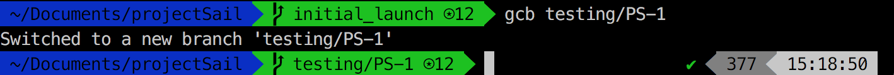
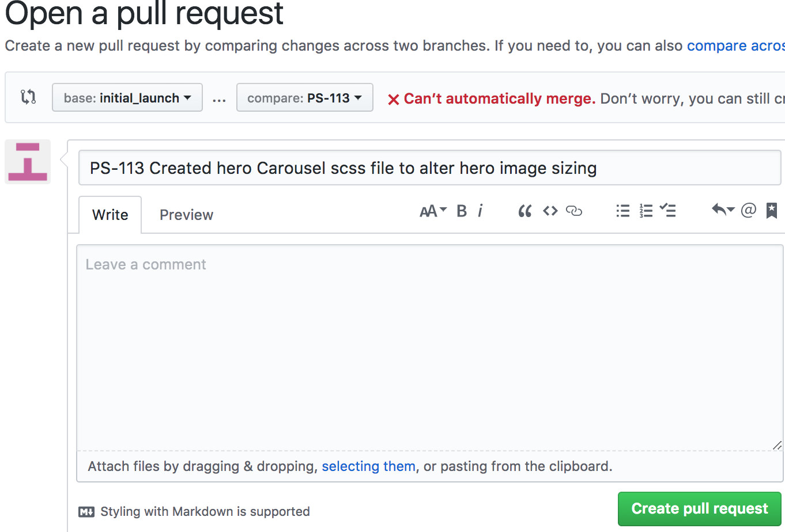

# Developer Workflow
This doc serves to clarify the procedures required once you get assigned, or pick up a ticket from the backlog or active sprint up until the ticket is solved. In a nutshell:
  1. ### Assign Ticket: Look over requirements and success criteria listed on the ticket and clarify any details with the reporter or QA
  <!-- add pics/links to the step below -->
  2. Create Branch: `git checkout -b PS-1` or with an alias like example below. Make a git branch for the ticket and push the branch to remote; make sure to follow naming conventions to invoke JIRA trigger from `'To Do'` to `'In Progress'`
    * Once branch is created, Jira will be triggered to set status from `To Do` to `In Progress`
  

  3. Work on Ticket: Follow the workflow conventions for commit procedures to trigger JIRA events and leave a paper trail for anyone following and/or collaborating on the same issue
    *   Frequent commits tied to each task completed to help track changes throughout branch
    *   Commit style: Using VIM, begin each commit with the branch name, time and then descritpion of task completed. `PS-1 #time 30m Changed Header Logo to Bold` 
    *   Example of this process will go as such:
    1. `git add .`
    2. `git commit`
        - inside VIM: `PS-1 #time 30m Changed Header Logo to Bold` 
    3. `git push origin PS-1`
    *   Repeat this process until ticket is solved

  4. Pull Request: Once all success requirements are met on the branch, submit a **pull request** to merge your branch into our working **master branch**, which should trigger the issue to move from `'In Progress'` to `'In Review'`
 

  5. Review Solution: The team will then review the solution and will either accept the pull request or clarify any additional work that needs to be done before the ticket can be merged, in which case repeat steps **3-4** until the team merges changes

  6. Delete Branches: Once the branch has been merged into the working master branch, delete the local and remote branches corresponding to the ticket so as to avoid potential conflicts
  <!-- link to bundling/bigcommerce procedure in the step below -->
  7. Once the branch is merged into the working master, the ticket will be moved from `'In Review'` to `'Staged'`
  8. At this point, probably once a few tickets have been staged, the team will **Bundle** the code and upload it to BigCommerce in order to make the changes available for visual QA.

    *   [Stencil Bundle Walkthrough](https://github.com/eoconnellTJ/ProjectSailReferences/blob/master/stencil_bundle.md)

  9. If the changes are **approved** by Visual QA, the ticket moves from `'Visual QA'` to `'Done'`, and if **rejected** the ticket moves back to `'In Progress'`, at which point you repeat steps **2-8**

<!-- *   Image of Jira ticket: -->

## Create Branch For Ticket
*   From the 'initial_launch' or freshest possible branch, create new branch for the specific ticket using the ticket ID as branch name. (i.e PS-1). 
*   `git checkout -b PS-1` or whichever number the ticket is*
*   Once branch is created, Jira will be triggered to set status from `To Do` to `In Progress`

##  Work on Ticket
*   Make sure to follow all guidelines for the project directory structure and best coding practices
*   Good commit practices include frequent commits tied to one task completed to help track changes throughout branch
*   Commit style: Using VIM, begin each commit with the branch name, time and then descritpion of task completed. `PS-1 #time 30m Changed Header Logo to Bold` 
*   Example of this process will go as such:
    1. `git add .`
    2. `git commit`
        - inside VIM: `PS-1 #time 30m Changed Header Logo to Bold` 
    3. `git push origin PS-1`
*   Repeat this process until ticket is solved

##  Submits Ticket
*   Create pull request 
*   Review code with team during SCRUM meeting
*   If Accepted, ticket is merged into the branch
    * Branch deleted from remote. 
    * Jira status now set to `Staged`
*   If Rejected, continue working on ticket until the issues addressed are resolved. Then repeat above steps.

## Bundle New Changes up to Production
*   Jira status will now reflect `Visual QA` 

## IF Ticket Accepted
*   Delete the branch and move on to the next ticket

## IF Ticket Kicked Back
*   Delete the branch locally and remote. `git branch -D PS-1`
*   Clarify requirements
*   Pull the latest working master branch (i.e `initial_launch`)
*   Once branch is up to date, create new working branch with same ticket name/id
*   `git checkout -b PS-1`
*   Repeat steps above.