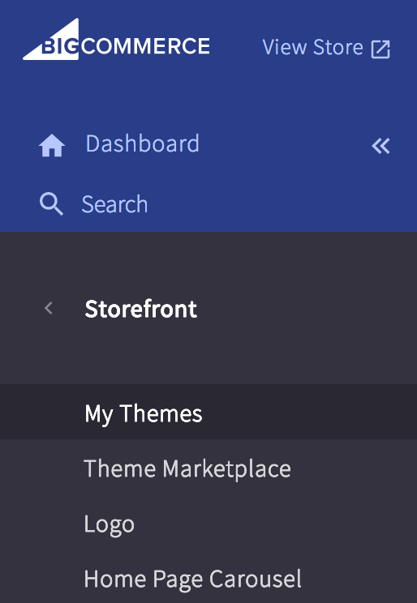
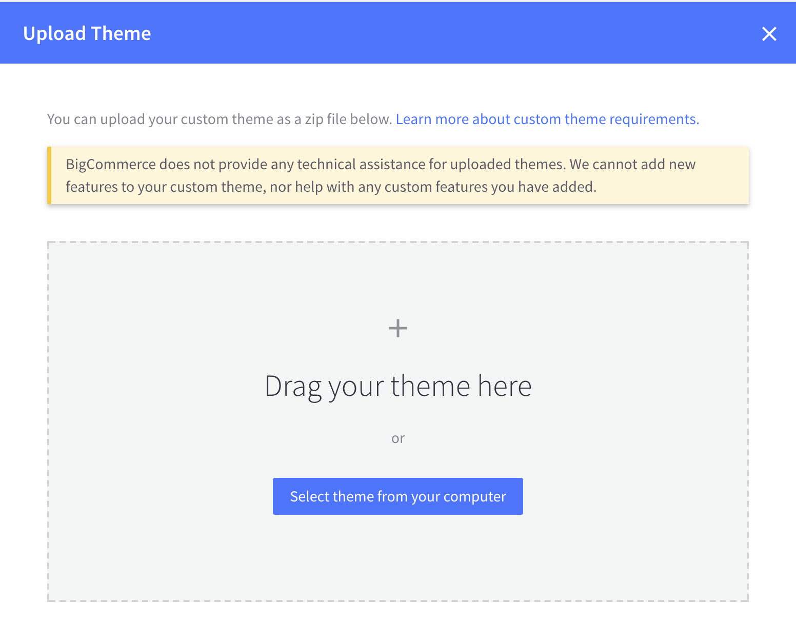
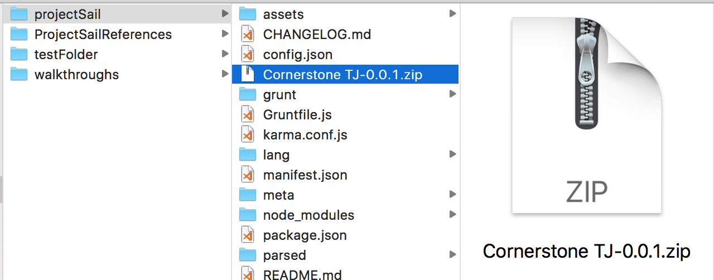

## Bundle a new package for BigCommerce

### From the Command Line
*   pull in all new changes
*   run `stencil bundle` which bundles and gives path to file
*   then,

### BigCommerce Dashboard
*   Click on `Storefront` > `My Themes` 

*   Select `Upload Theme`

*   Go to BC folder inside of `ProjectSail` directory
*   Select your theme

*   Once theme is uploaded, rename to Cornerstone TJ-{MMDDYY}
*   Apply theme

### References

[BC Docs](https://stencil.bigcommerce.com/docs/bundling-submitting)